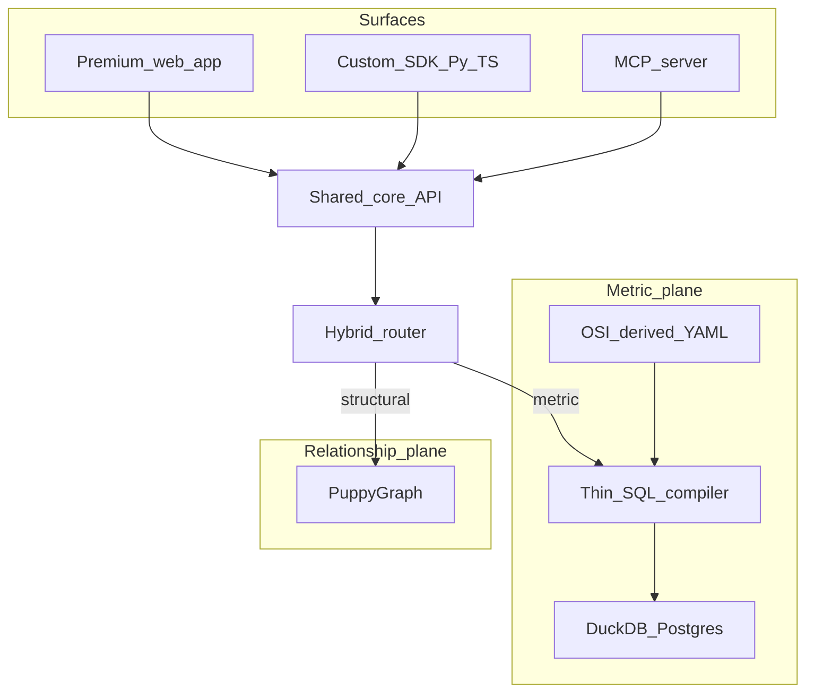

# Semgraf — dual-plane data agent framework

## Brand (locked)

| Field | Value |
|-------|--------|
| **Name** | **Semgraf** |
| **One-liner** | Semgraf — dual-plane runtime for data agents: compile governed metrics, traverse verified relationships. |
| **Pitch (YC)** | Semgraf: metrics that compile, relationships that verify — one runtime under your agents. |
| **Repo** | **Private** under [gauravsagar483](https://github.com/gauravsagar483/gauravsagar483) → `https://github.com/gauravsagar483/semgraf` |
| **Internal codename** | dual-plane / Dualplane (concept only — product name is Semgraf) |

Do **not** put this inside any employer org repo.

## Clean-room / naming (must follow)

**Not legal advice.** Confirm with employment agreement + manager COI / counsel. Full founder checklist: [`semgraf_founder_ops_a41d7cbb.plan.md`](semgraf_founder_ops_a41d7cbb.plan.md) § Clean-room.

| Rule | Semgraf implication |
|------|---------------------|
| Outside business / COI | Disclose Semgraf to manager + employer COI process **before** public demos, YC, design partners |
| Confidential = code, algorithms, models, trade secrets, non-public tech | Zero employer files, schemas, prompts, evals, internal docs in this repo |
| Company IT / work product | Personal machine only; never develop on employer laptop/VPN |
| Inventions in course of duties | Do not re-home employer patent/text2SQL claims into Semgraf; fresh design |
| Employment invention assignment | Job-scope overlap (metrics agents, SQL gen, metagraph) = highest ownership risk |
| Naming | Brand = **Semgraf** only — never employer product names or marks |

**Banned in Semgraf codebase/marketing:** employer product names, internal schema names, real employer table/metric IDs, copied Cypher/YAML from employer systems, employer secret/config patterns.

**Allowed inspiration (public only):** Colrows, Cube, dbt, Atlan/DataHub marketing, PuppyGraph public docs, open OSI/MetricFlow docs — rewrite clean-room.

## What we are (and are not)

**Are:** Dual-plane **product** — metric compile + relationship traverse — with a **best-in-class web app**, **custom SDK**, and MCP. Colrows-inspired execution story ([colrows.com](https://colrows.com/)); Attio-inspired product craft ([attio.com](https://attio.com/)). Dual-plane architecture from public patterns only.

**Are not:** Colrows feature-parity (no 16 dialects, no autonomous Consensus/Weaviate/Mongo stack day one). Not an employer-product port. Not “rebuild the world without OSS.” Not Semantica (context/decision graphs) — Semgraf owns **compile + traverse**.



## Locked decisions

| Decision | Choice |
|----------|--------|
| Brand | **Semgraf** |
| Phase-1 paths | Dual: metric + graph on one toy world |
| Metric compile | Thin own compiler now; MetricFlow later |
| Semantic format | OSI-derived YAML (not pinned to moving Ossie) |
| Graph | PuppyGraph on toy tables |
| **Web** | **Primary product surface — premium bar** (not “thin chat”) |
| SDK | First-party Python + TypeScript (`semgraf` / `@semgraf/sdk`) |
| MCP | First-class for Cursor/Claude |
| Router | Rules + LLM hybrid |
| Fixtures | Ecommerce primary; Fintech second pack |
| Repo | **Private** `gauravsagar483/semgraf` (clean-room; nights/weekends) |
| Clean-room | COI before public; no employer patents/code/names in product |

---

## Open-source usage policy (answer)

**You do NOT need fresh everything.** Clean-room = no employer proprietary code/docs/schemas — **not** “no public libraries.”

| Library class | Typical license | Commercial closed product? |
|---------------|-----------------|----------------------------|
| LangChain | MIT | Yes — keep notice |
| FastMCP / MCP SDK | Apache-2.0 | Yes — NOTICE/attribution |
| FastAPI, Pydantic, sqlglot | MIT / BSD-ish | Yes |
| Neo4j driver, httpx, etc. | Check each | Usually yes if permissive |
| AGPL / SSPL / some BSL | Restrictive | Avoid or isolate; get counsel |

**Rules of thumb**

1. Prefer **MIT / Apache-2.0 / BSD** for core.
2. Keep a `THIRD_PARTY_NOTICES` (or license wheel metadata).
3. Don’t vendor-copy huge GPL into your proprietary tree without counsel.
4. LangChain for router/agent glue = fine; **USP stays** compiler + dual-plane + graph — not “we wrapped LangChain.”
5. Optional: thin own agent loop first; add LangChain only if it saves real time.

PuppyGraph / Neo4j: separate **product** licenses for deployment — check PuppyGraph edition terms for redistribution vs self-host demo.

---

## Premium web UI plan (primary surface)

Bar: [Attio](https://attio.com/) for agentic product craft (live traces, calm density, motion with purpose); [Colrows](https://colrows.com/) for “compile → prove → execute” clarity. **Do not clone** either brand. Own visual system; **Semgraf** as hero brand signal.

### Product jobs (one composition per view)

1. **Ask** — hero workspace: question → dual-plane answer (default landing).
2. **Trace** — plane, compile/Cypher, version hash, latency (always one click away; inline in Ask).
3. **Semantics** — browse OSI-derived metrics/entities (read-only v1; edit later).
4. **Graph** — blast-radius / lineage visualization (simple force or hierarchical; not Neo4j Bloom day one).
5. **Fixtures** — switch ecommerce ↔ fintech (dev/demo).

### UX principles

- Brand-first shell: **Semgraf** as hero signal on Ask; not a dashboard of widgets.
- One job per screen; Trace is part of Ask, not a separate “ops console” cluttering first viewport.
- Show **plane badge** (Metric | Relationship) the moment router decides — Attio-like “tool ran” feedback.
- Streaming: token/status then structured result cards (SQL block, table, graph list).
- Empty/refuse states as features (Colrows: fail loud > wrong number).
- Motion: 2–3 intentional (route badge in, trace expand, result settle) — not noise.
- Typography: distinctive (not Inter/Roboto default stack). Dark or light: pick one coherent system; avoid generic AI-purple gradient cliché.
- Responsive: desktop-first for YC demo; usable tablet.

### Tech (web)

- **Vite + React + TypeScript** SPA; talk to FastAPI (`/api/ask` stream + REST).
- CSS: own tokens (or Tailwind with custom theme — not stock shadcn purple).
- Charts: light (metric result tables first; charts phase 4).
- Auth: none in Phase 1–3 (local demo); stub API key later.

### Web phase split

| Phase | Web scope |
|-------|-----------|
| 1 | Ask + Trace for **metric** only — polished enough for “wow” |
| 2 | Relationship answers + simple lineage list/graph in Trace |
| 3 | Hybrid router + plane badge + manual plane override |
| 4 | Semantics browser + fixture switcher + polish pass |

**YC video:** open web Ask first (10s magic), then 20s Cursor MCP — web is the hero.

---

## Custom SDK plan

**Goal:** same core as web/MCP; embedders don’t scrape HTTP by hand.

### Packages

- `semgraf` (Python): sync/async client — `ask()`, `compile_metric()`, `blast_radius()`, `list_metrics()`, streaming `ask_stream()`.
- `@semgraf/sdk` (TypeScript): isomorphic for web + Node agents.

### Design

- Thin HTTP client over FastAPI (primary); optional MCP client helper for agent hosts.
- Typed models (Pydantic / Zod) shared via OpenAPI codegen where possible.
- Errors: `OutOfScopeError`, `AmbiguousRouteError`, `CompileError` with machine codes.
- Version header: `X-Semgraf-Definition-Version` for attestation story.

### Phase

- After Phase 1 core API exists → ship Python SDK.
- Phase 3 → TypeScript SDK used by the web app (dogfood).
- Docs: 1-page quickstart in repo (private).

---

## Phase demos (updated)

### Phase 0 — Skeleton

- Create **private** repo: `gh repo create gauravsagar483/semgraf --private --description "Semgraf — dual-plane runtime for data agents"`
- Monorepo: `apps/api`, `apps/web`, `packages/sdk-py`, `packages/sdk-ts`, `fixtures/`, `docker-compose.yml`.
- Compose: Postgres/DuckDB + PuppyGraph.
- Ecommerce seed + YAML + graph schema stubs.
- README: Semgraf one-liner + clean-room note (no employer paths).

### Phase 1 — Metric plane + premium Ask UI

- Thin compiler + core API.
- Web Ask + Trace (metric) at high craft bar.
- MCP `ask_metric` / `list_metrics` / `compile_metric`.
- Python SDK v0.

### Phase 2 — Relationship plane in product

- PuppyGraph + guards.
- Web shows relationship answers + lineage UI.
- MCP graph tools.
- TS SDK starts powering web.

### Phase 3 — Dual runtime

- Hybrid router; plane badge + override.
- Full MCP tool set; SDK `ask()` routes server-side.
- YC 1-min video.

### Phase 4 — Harden

- Fintech fixture; eval set; attestation fields on SDK responses.

### Later

- MetricFlow / Ossie import; equivalence gate; studio editing; RBAC; multi-dialect.

## Repo layout (target)

```text
semgraf/                          # github.com/gauravsagar483/semgraf (private)
  apps/api/                       # FastAPI + MCP mount + compiler + router + graph
  apps/web/                       # Vite React premium UI
  packages/sdk-py/                # uv: semgraf
  packages/sdk-ts/                # pnpm: @semgraf/sdk
  fixtures/ecommerce/
  fixtures/fintech/
  semantic/                       # OSI-derived YAML
  graph/                          # PuppyGraph schema
  docker-compose.yml
  THIRD_PARTY_NOTICES
  tests/
```

## Success criteria (Phase 3)

- Web Ask feels product-grade (not prototype form); **Semgraf** brand clear.
- Dual planes + hybrid router work on ecommerce.
- SDK + MCP call same core.
- Demo video: web first, MCP second.
- Zero employer files; OSS licenses attributed; lives only under `gauravsagar483/semgraf`.

## Risks

- Premium UI time vs backend — front-load Ask shell in Phase 1; don’t defer “polish” to end.
- PuppyGraph schema tax — keep lineage toy-small.
- LangChain optional — don’t let framework sprawl eat USP work.
- Name near-miss Semantica — say “Sem-graf”; keep one-liner on compile+traverse.
- **Clean-room / COI** — domain overlap with day job; skip COI gate → career + ownership risk. Clean-room drift (copying from employer repos) kills the company thesis.
