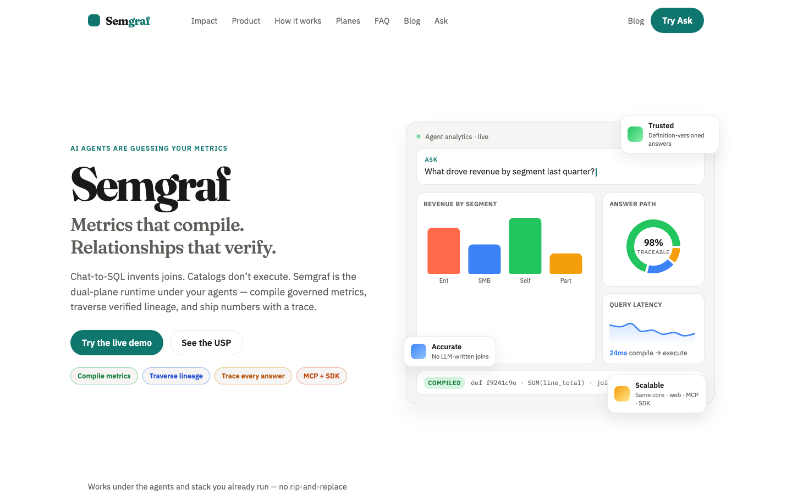
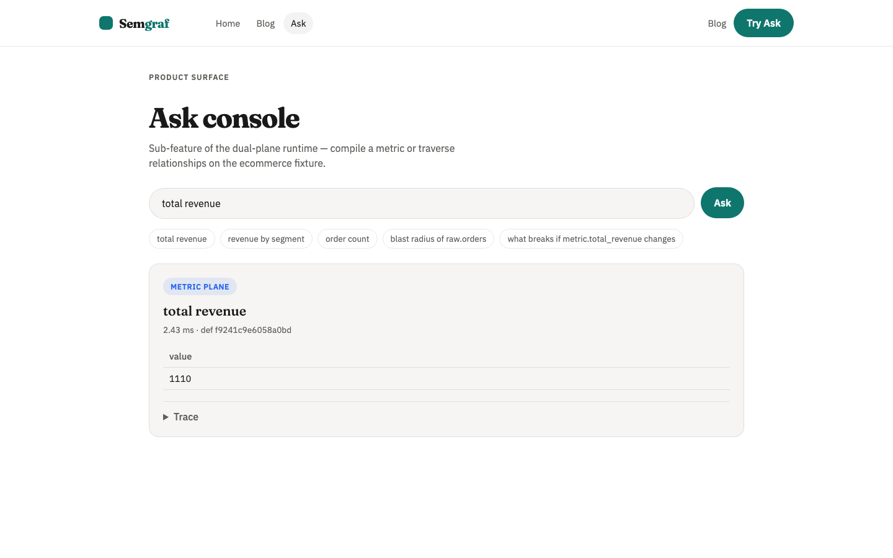
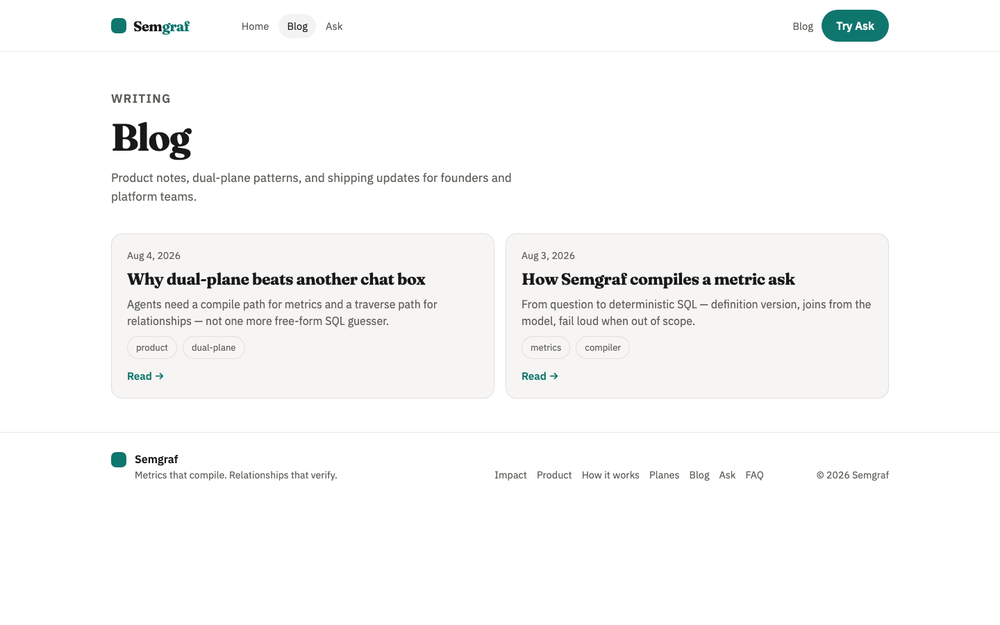

# Semgraf

**Semgraf** — dual-plane runtime for data agents: compile governed metrics, traverse verified relationships.

Clean-room personal product. Public libraries OK. No employer code, schemas, or marks.

**Tooling:** **uv** (Python) + **pnpm** (JS).

## Layout

```text
apps/api/          # FastAPI + metric compiler + graph stubs + MCP (later)
apps/web/          # Vite React Ask + Trace
packages/sdk-py/   # uv workspace: semgraf
packages/sdk-ts/   # pnpm workspace: @semgraf/sdk
fixtures/          # ecommerce (primary), fintech (later)
semantic/          # OSI-derived YAML
graph/             # lineage seed for relationship plane
.agents/           # plans, memory, rules, skills
```

## Quick start (Phase 0–1)

Requires: [uv](https://docs.astral.sh/uv/), [pnpm](https://pnpm.io/) (Node ≥20).

```bash
# Python workspace (API + SDK)
uv sync --all-packages --group dev
uv run --package semgraf-api pytest apps/api/tests
uv run --package semgraf-api semgraf-api
# or: uv run --package semgraf-api uvicorn semgraf_api.main:app --reload --port 8080

# JS workspace (web + TS SDK)
pnpm install
pnpm dev
```

Open http://localhost:5173 — Ask a metric (e.g. `total revenue`).

## UI

Marketing site + Ask console (local screenshots):

| Landing | Ask | Blog |
|---------|-----|------|
|  |  |  |

- `/` — brand-first marketing
- `/ask` — dual-plane Ask + Trace (ecommerce fixture)
- `/blog` — product notes

## Phases

See `.agents/plans/dual-plane_agent_framework_6af3daeb.plan.md` and `.agents/skills/build-phase/SKILL.md`.

| Phase | Status |
|-------|--------|
| 0 Skeleton | done |
| 1 Metric + Ask | done (MVP) |
| 2 Relationship plane | pending |
| 3 Dual runtime | pending |
| 4 Harden | pending |

## License / notices

Proprietary product code. Third-party licenses: `THIRD_PARTY_NOTICES`.
